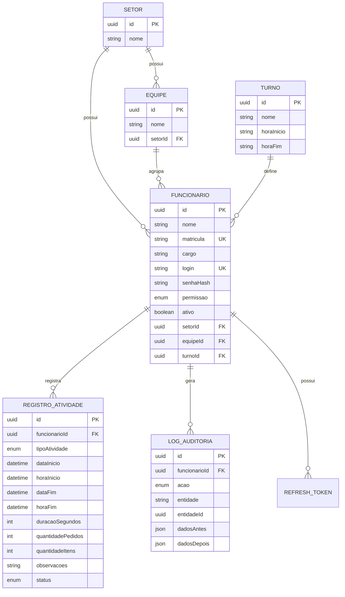

# Diagrama de Entidade-Relacionamento

Caminho: `ARQUITETURA.md` (raiz do projeto)

## Decisões de modelagem

1. **`RegistroAtividade` é o coração do sistema.** Cada início/fim de
   atividade é uma linha. `duracaoSegundos` é calculado no momento do
   encerramento (nunca confiar em cálculo feito no front).
2. **Índice único parcial** (`WHERE status = 'ABERTO'`) impede duas
   atividades abertas para o mesmo funcionário — reforça no banco a regra
   que também será validada no service, evitando condição de corrida.
3. **`Equipe` e `Turno` são opcionais** no funcionário porque nem toda
   operação organiza por equipe/turno no dia 1, mas o campo já existe para
   os filtros do dashboard (`Data, Funcionário, Equipe, Setor, Turno`)
   pedidos no escopo.
4. **`LogAuditoria` é genérico** (`entidade` + `entidadeId` + JSON antes/depois)
   para não precisar de uma tabela de auditoria por entidade — cobre
   qualquer alteração futura sem migration nova.
5. **Relatórios não têm tabela própria.** São sempre calculados sob demanda
   a partir de `RegistroAtividade` (agregações), garantindo que nunca
   fiquem dessincronizados dos dados reais.
